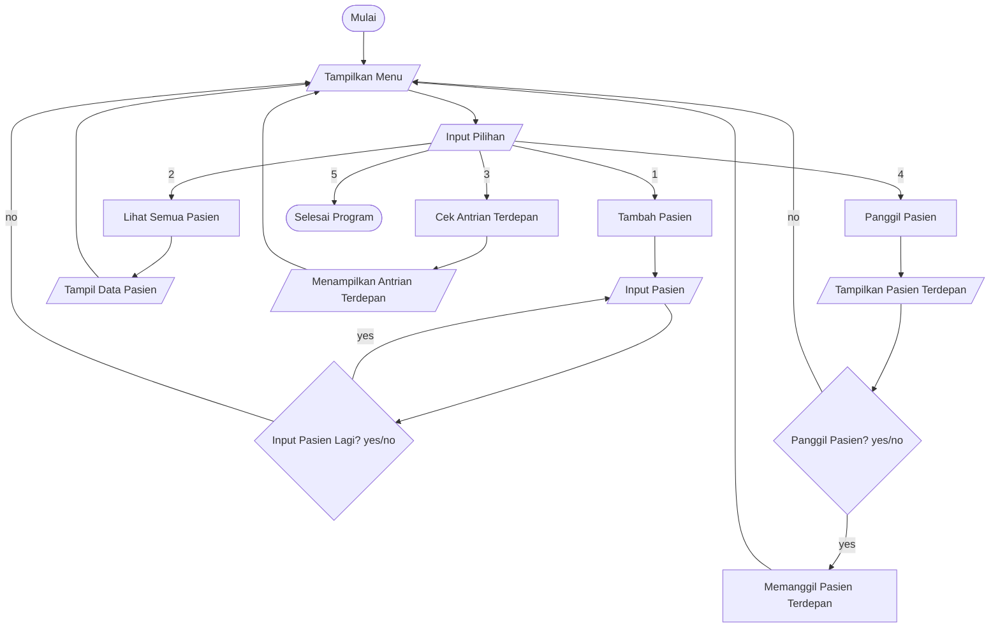

# 📚 Struktur Data – UTS
## Sistem Antrian Rumah Sakit (queue)

Link PPT : https://canva.link/p8vs8r8g4jy5yix
---

## 👤 Identitas Kelompok

| NIM | Nama        | Kelas        | Akun Github   |
|----|-------------|--------------------|----------|
| 2501010004  | Dewa Gede Agung Dwi Angga Suputra  | A       | BebekTerbang334     |
| 2501010018  | Dewa Gede Maha Putra  | A  |  Doremika452 |
| 2501010052  | I Kadek Cri Bhaskara Wirawan Sutha   | A          | Keydak  |


---


# 🎯 Rumusan Masalah

> 1. Bagaimana cara mengimplementasikan konsep queue (FIFO) dalam sistem antrian pasien di rumah sakit menggunakan OOP?


**Jawaban:**

Konsep queue (FIFO) diimplementasikan dengan menggunakan struktur data list, di mana pasien yang datang pertama akan dilayani terlebih dahulu. Dalam OOP, dibuat sebuah class (misalnya `AntrianRumahSakit`) yang memiliki atribut antrian dan method seperti `tambah_pasien()` untuk menambah data ke belakang antrian dan `panggil_pasien()` untuk mengambil data dari depan antrian menggunakan `pop(0)`.

> 2. Bagaimana sistem dapat mengelola proses penambahan, pemanggilan, dan penampilan data antrian pasien secara efektif?

Sistem mengelola antrian dengan menyediakan beberapa method utama, yaitu:

* `tambah_pasien()` untuk menambahkan pasien ke antrian
* `panggil_pasien()` untuk memanggil pasien sesuai urutan
* `lihat_antrian()` untuk menampilkan seluruh daftar antrian
  Dengan pembagian fungsi ini, pengelolaan data menjadi lebih terstruktur, mudah dipahami, dan efisien.
  
> 3. Bagaimana sistem dapat memberikan informasi jumlah antrian dan urutan pasien secara akurat?

**Jawaban:**
Sistem menggunakan method `jumlah_antrian()` untuk menghitung jumlah pasien dalam antrian dengan fungsi `len()`. Sedangkan urutan pasien ditampilkan menggunakan perulangan (`enumerate`) pada method `lihat_antrian()`, sehingga setiap pasien memiliki nomor urut yang jelas dan akurat.

---

# 📖 Ringkasan Teori

## 1. Apa itu Struktur Data?

Dalam pemrograman, struktur data memiliki peran penting dalam menentukan kinerja program, kompleksitas kode, serta efisiensi penggunaan sumber daya komputer. Pemilihan struktur data yang tepat akan mempermudah proses pengolahan, pencarian, dan penyimpanan data.

Menurut Herawan (2022), struktur data adalah cara mengorganisasi dan menyimpan data dalam komputer yang dapat mempengaruhi kinerja program dan efisiensi penggunaan sumber daya.

Struktur data juga dapat dipahami sebagai metode penyimpanan dan pengaturan data secara terstruktur dalam sistem komputer agar mempermudah proses akses dan pengolahan data (“Artikel Struktur Data, Audit dan Jaringan Komputer,” 2018).

Selain itu, dalam teknik pemrograman, struktur data merujuk pada tata letak data yang terdiri dari kolom dan baris (record), baik yang terlihat oleh pengguna maupun yang digunakan untuk kebutuhan internal sistem (Jodi, 2024).


📚 Referensi:
- Herawan, B. (2022). Buku Algoritma dan Struktur Data.  
- “Artikel Struktur Data, Audit dan Jaringan Komputer.” (2018).  
- Jodi, I. D. (2024). Algoritma dan Struktur Data.

## 2. Konsep Queue

Menurut Rizaldy Gunawan, H. Yuana, dan S. Kirom. (2023) Queue atau antrian merupakan salah satu struktur data yang bekerja dengan prinsip FIFO (First In First Out), yaitu elemen yang pertama kali masuk akan menjadi elemen pertama yang keluar. Dalam implementasinya, antrian memiliki dua operasi utama, yaitu enqueue untuk menambahkan elemen ke dalam antrian dan dequeue untuk menghapus elemen dari antrian. Struktur antrian ini dapat diimplementasikan menggunakan linear array maupun circular array tergantung pada kebutuhan sistem dan efisiensi pengelolaan memori.

Menurut Mayangsari dan Prastiwi, (2016) model antrian (queueing model) merupakan pendekatan matematis yang digunakan untuk menganalisis sistem pelayanan, khususnya dalam memahami perilaku antrian. Tujuan utama dari model ini adalah meminimalkan total biaya, baik biaya langsung dalam penyediaan fasilitas layanan maupun biaya tidak langsung akibat waktu tunggu pelanggan. Selain itu, model antrian juga digunakan untuk memprediksi kinerja sistem, seperti jumlah pelanggan dalam antrian, waktu tunggu, waktu pelayanan, serta tingkat utilisasi server.

Lestari (2018) mengatakan dalam penerapan sistem antrean, pemilihan struktur data yang tepat sangat penting untuk menjaga keadilan dan keteraturan layanan. Struktur data queue dengan prinsip FIFO dianggap paling ideal karena memastikan bahwa setiap elemen diproses sesuai urutan kedatangannya. Untuk meningkatkan fleksibilitas, penggunaan linked list sering dipilih karena mampu menyesuaikan ukuran antrian secara dinamis tanpa batas kapasitas awal seperti pada array. Hal ini menjadikan sistem lebih efisien dalam menangani perubahan jumlah data secara terus-menerus.

📚 Referensi:
- Rizaldy Gunawan, H. Yuana, & S. Kirom, 2023.
- Mayangsari & Prastiwi, 2016; Darmawan et al., 2023. 
- Lestari, 2018; Dewi, 2020.

---

## 3. Konsep FIFO

Algoritma *First In First Out (FIFO)* merupakan metode yang digunakan dalam sistem antrian tanpa prioritas, di mana elemen yang pertama kali masuk akan diproses terlebih dahulu. Prinsip ini bekerja secara berurutan dan bergiliran sesuai dengan urutan kedatangan, tanpa adanya perlakuan khusus terhadap elemen tertentu. FIFO banyak diterapkan dalam berbagai bidang, baik dalam kehidupan sehari-hari maupun dalam sistem komputer dan teknologi.

Menurut Fitriani dan Apridiansyah (2021), algoritma FIFO sering dimanfaatkan dalam aplikasi berbasis teknologi, seperti sistem antrian pembayaran, karena mampu menjaga keteraturan proses secara adil. Setiap pengguna atau data diproses sesuai urutan masuknya, sehingga meminimalkan konflik dan meningkatkan efisiensi layanan. Hal ini menjadikan FIFO sebagai solusi yang sederhana namun efektif dalam pengelolaan antrian.

Selain itu, Hidayat, Noor, dan Al Amin (2018) menjelaskan bahwa FIFO memiliki sifat berurutan dan tetap mengikuti jalur proses yang telah ditentukan sejak awal. Dengan kata lain, tidak ada elemen yang dapat melompati antrean, sehingga sistem berjalan secara konsisten dan terstruktur. Pendekatan ini sangat cocok digunakan dalam sistem pengaduan pelanggan atau layanan publik yang membutuhkan keadilan dalam penanganan.

Dalam bidang persediaan barang, metode FIFO juga digunakan untuk mengatur alur keluar masuk barang. Menurut Hendarman Lubis dkk., barang yang pertama kali masuk akan menjadi barang yang pertama kali dikeluarkan atau dijual. Metode ini membantu menjaga kualitas barang, terutama untuk produk yang memiliki masa simpan, serta mempermudah pencatatan stok secara sistematis dan akurat.

📚 Referensi:
- Fitriani, F., & Apridiansyah, Y. (2021). Aplikasi Antrian Pembayaran Uang Kuliah Berbasis Android Menggunakan Algoritma FIFO di Universitas Muhammadiyah Bengkulu. JUSIBI, 3(2), 91–103.  
- Hidayat, F., Noor, F., & Al Amin, I. H. (2018). Implementasi Metode FIFO untuk Analisa Sistem Antrian Pengaduan Pelanggan ISP. Dinamik, 23(2), 73–79.  
- Lubis, H., Fitriyani, A., & Prayitno, M. H. Sistem Informasi Persediaan Barang Jadi Menggunakan Metode FIFO pada PT Rubberman Indonesia.
  
---

## 4. Implementasi Menggunakan Array

Menurut Hindriani, N., Narwen, & Yozza, H. (2016) Dalam implementasi menggunakan arrat pada awalnya antrian berada dalam kondisi kosong sehingga tidak ada elemen yang dapat dihapus. Jika dilakukan penghapusan pada kondisi ini, maka akan terjadi kesalahan yang disebut underflow. Sebaliknya, penambahan elemen hanya dapat dilakukan ketika antrian belum penuh. Jika antrian sudah penuh, maka penambahan elemen baru akan menyebabkan overflow, sehingga elemen tersebut harus menunggu hingga tersedia ruang dalam antrian.

Menurut Cormen, T. H., et al. Implementasi array digunakan untuk merepresentasikan antrian pasien dalam sistem rumah sakit dengan memanfaatkan list di Python (self.antrian = [ ]). Data pasien disimpan secara berurutan, di mana penambahan dilakukan dengan append() (menambah di akhir) dan pemanggilan pasien menggunakan pop(0) (menghapus dari awal). Mekanisme ini mengikuti konsep FIFO (First In First Out), yaitu pasien yang datang lebih dahulu akan dilayani terlebih dahulu. Fungsi tambahan seperti lihat_antrian() digunakan untuk menampilkan isi antrian, sedangkan jumlah_antrian() untuk menghitung jumlah data.

Namun, Goodrich, M. T., dan Tamassia, R. mengatakan penggunaan array memiliki keterbatasan, khususnya pada operasi pop(0) yang memiliki kompleksitas O(n) karena harus menggeser elemen lainnya. Hal ini membuatnya kurang efisien untuk jumlah data besar. Oleh karena itu, dalam praktiknya sering digunakan struktur data lain seperti collections.deque yang lebih optimal untuk operasi antrian.

📚 Referensi:
- Cormen, T. H., et al. Introduction to Algorithms. MIT Press.
- Goodrich, M. T., & Tamassia, R. Data Structures and Algorithms in Python. Wiley.
- Hindriani, N., Narwen, & Yozza, H. Implementasi Antrian dengan Menggunakan Array. (2016)


---


# 💻 Desain Sistem (Flowchart)



## 1. Input

Data yang masuk dari user:

* `pilihan = input("Pilih menu: ")`
* `nama = input("Masukkan nama pasien: ")`
* `pilihan1 = input("Ingin menginput pasien lagi? (yes/no): ")`

Intinya:

* User memilih menu (1–5)
* User memasukkan nama pasien saat tambah data

---

## 2. Proses

Program memproses input berdasarkan menu:

### Menu 1 → Tambah Pasien

* Method: `tambah_pasien(nama)`
* Proses: `self.antrian.append(nama)`
* Bisa loop input berkali-kali (yes/no)

### Menu 2 → Lihat Antrian

* Method: `lihat_antrian()`
* Proses:

  * Ambil semua data dari list `self.antrian`
  * Format jadi tabel pakai `tabulate`

### Menu 3 → Cek Antrian Terdepan (peek)

* Method: `cek_antrian_selanjutnya()`
* Proses:

  * Ambil elemen pertama: `self.antrian[0]`

### Menu 4 → Panggil Pasien (dequeue / FIFO)

* Method: `panggil_pasien()`
* Proses:

  * Ambil & hapus data pertama: `self.antrian.pop(0)`

### Menu 5 → Keluar

* Proses: `break` (menghentikan program)

---

## 3. Output

Hasil yang ditampilkan ke user:

* Tambah pasien →
  `Pasien 'X' ditambahkan ke antrian`

* Lihat antrian →
  Tabel daftar pasien

* Cek antrian →
  `Pasien berikutnya: X`

* Panggil pasien →
  `Memanggil pasien: X`

* Jika kosong →
  `Antrian kosong`


---


# 💻 Implementasi Program 
``` python
import os
from tabulate import tabulate


class AntrianRumahSakit:
    def __init__(self):
        self.antrian = []

    #enqueue
    def jumlah_antrian(self):
        return len(self.antrian)

    #dequeue
    def tambah_pasien(self, nama_pasien):
        self.antrian.append(nama_pasien)
        print(f"Pasien '{nama_pasien}' ditambahkan ke antrian.")
        
    #peek    
    def cek_antrian_selanjutnya(self):
        if not self.antrian:
            print("Antrian kosong.")
        else:
            print(f"Pasien berikutnya: {self.antrian[0]}")

    # FIFO
    def panggil_pasien(self):
        if not self.antrian:
            print('Antrian kosong, tidak ada pasien.')
        else:
            pasien = self.antrian.pop(0)
            print(f"Memanggil pasien: {pasien}")
                         
    #display
    def lihat_antrian(self):
        if not self.antrian:
            print("Antrian kosong.")
        else:
            print("Daftar antrian pasien:")
            data = [[i, pasien]
                    for i, pasien in enumerate(self.antrian, start=1)]
            print(tabulate(data, headers=[
                  "No", "Nama Pasien"], tablefmt="psql"))


antrian_rs = AntrianRumahSakit()

while True:
    os.system("cls")
    print("\n=== Sistem Antrian Rumah Sakit ===")
    print("1. Tambah Pasien")
    print("2. Lihat Semua Pasien")
    print("3. Cek Antrian Terdepan")
    print("4. Panggil Pasien")
    print("5. Keluar")

    pilihan = input("Pilih menu: ")

    if pilihan == "1":
        nama = input("Masukkan nama pasien: ")
        antrian_rs.tambah_pasien(nama)
        while True:
            pilihan1 = input("Ingin menginput pasien lagi? (yes/no) : ")

            if pilihan1 == "yes":
                nama = input("Masukkan nama pasien: ")
                antrian_rs.tambah_pasien(nama)
            elif pilihan1 == "no":

                break
            else:
                print("Pilihan tidak valid.")
    elif pilihan == "2":
        antrian_rs.lihat_antrian()
        input("\nTekan Enter untuk lanjut...")
    elif pilihan == "3":
        antrian_rs.cek_antrian_selanjutnya()
        input("\nTekan Enter untuk lanjut...")
    elif pilihan == "4":
        antrian_rs.panggil_pasien()
        input("\nTekan Enter untuk lanjut...")
    elif pilihan == "5":
        print("Program selesai.")
        break
    else:
        print("Pilihan tidak valid.")
        input("\nTekan Enter untuk lanjut...")
```


---


# :newspaper: Kesimpulan

Kesimpulan dari implementasi sistem antrian pasien rumah sakit menggunakan konsep queue (FIFO) menunjukkan bahwa seluruh rumusan masalah telah berhasil diselesaikan dengan baik. Program yang dibuat mampu mengimplementasikan prinsip FIFO menggunakan struktur data list, di mana pasien yang datang terlebih dahulu akan dilayani lebih dahulu. Sistem juga telah dirancang secara terstruktur melalui penggunaan method seperti `tambah_pasien()`, `panggil_pasien()`, `lihat_antrian()`, dan `jumlah_antrian()`, sehingga proses pengelolaan data menjadi lebih efektif, terorganisir, dan mudah dipahami. Selain itu, sistem dapat menampilkan jumlah dan urutan pasien secara akurat dengan memanfaatkan `fungsi len()` dan `enumerate()`.

Dari sisi kesesuaian teori, implementasi program telah berjalan sesuai dengan konsep dasar struktur data queue, yaitu proses enqueue menggunakan `append()` dan dequeue menggunakan `pop(0)`. Mekanisme ini memastikan bahwa urutan pelayanan tetap konsisten sesuai prinsip FIFO. Program juga telah mampu menangani kondisi antrian kosong (underflow), serta menunjukkan keterbatasan penggunaan array, khususnya pada operasi `pop(0)` yang memiliki kompleksitas waktu `O(n)`. Hal ini sejalan dengan teori yang menyatakan bahwa penggunaan array kurang efisien untuk antrian berskala besar.

Secara keseluruhan, penggunaan struktur data queue dalam sistem ini memberikan manfaat yang signifikan, terutama dalam menjaga keadilan pelayanan dan keteraturan proses antrian. Sistem menjadi lebih sistematis, mudah dikembangkan, serta relevan untuk diterapkan pada berbagai kasus layanan seperti rumah sakit, bank, maupun sistem pelayanan publik lainnya. Dengan demikian, dapat disimpulkan bahwa implementasi queue (FIFO) dalam program ini tidak hanya berhasil secara teknis, tetapi juga efektif dalam menyelesaikan permasalahan antrian secara nyata.
